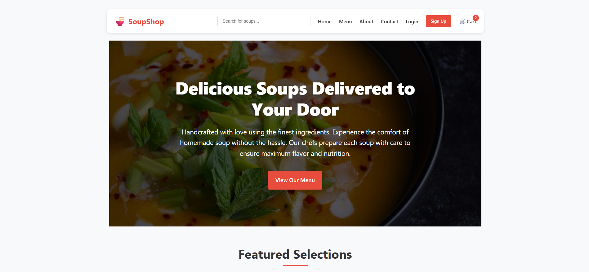
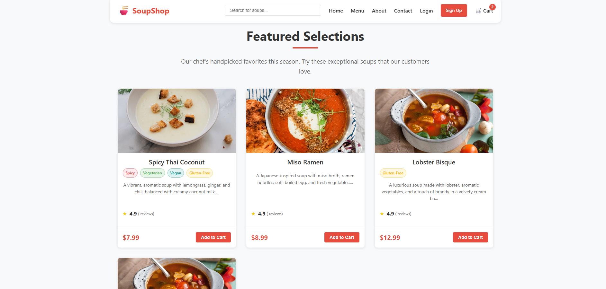
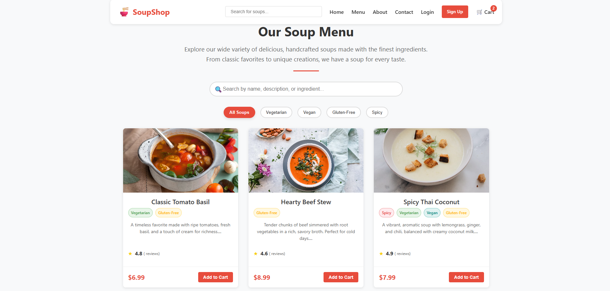
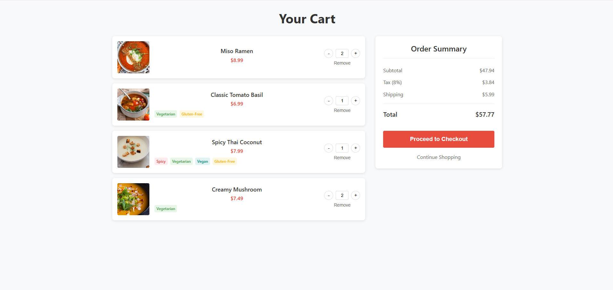

# Soup Shop Frontend

<p align="center">
  
</p>
<p align="center">
  
</p>
<p align="center">
  
</p>
<p align="center">
  
</p>

---

This is the frontend application for the Soup Shop, a web application for ordering delicious soups online.

## Features

- Browse soups by category
- View detailed information about each soup
- Add soups to shopping cart
- Manage cart items (update quantity, remove items)
- User authentication (login/register)
- Checkout process
- Order history
- Order details

## Technologies Used

- React 18
- TypeScript
- React Router v6
- React Query
- Styled Components
- Axios
- Vite

## Getting Started

### Prerequisites

- Node.js (v14 or higher)
- npm or yarn

### Installation

1. Clone the repository
   ```bash
   git clone https://github.com/Mokhaled2004/SoupShop.git
   ```
2. Navigate to the frontend directory:
   ```bash
   cd SoupShop/frontend
   ```
3. Install dependencies:

   ```bash
   npm install
   ```

   or

   ```bash
   yarn install
   ```

4. Run the Application:
   ```bash
   npm run dev
   ```
   The application will be running at http://localhost:5173
